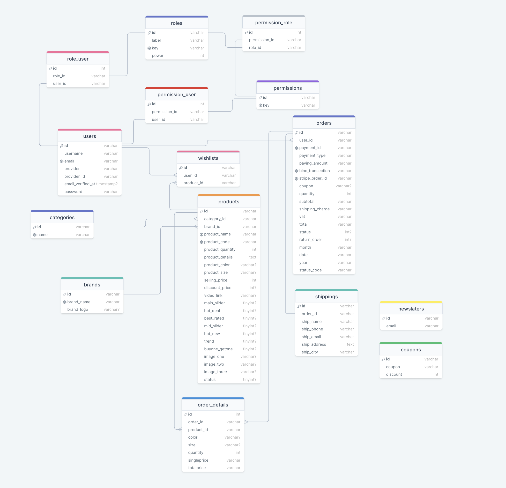

# Manga API

### Contributors 
- [Nathael Bonnal](https://www.linkedin.com/in/nathael-bonnal/)
- Rafael Salort

---

### Info
- NodeJS v14 or +
- Writting in Typescript
- SGBD : PostgreSQL
- Framework: AdonisJS
- [Sheet of functionalities](https://docs.google.com/spreadsheets/d/1rEeY5Xd0dgGinnz60J_F5a5qezl4mlgQnSq_TC_VSnE/edit?usp=sharing)

### Guide
```shell
git clone git@github.com:NathaelB/MangaApi.git
cd ./MangaApi
npm install
cp .env.example .env
# Configure the environment file

# For launch in development environment
npm run dev

# For deploy
# With DOCKER
```

### Permission management
Each model is assigned a `Policy`, in this policy it is given actions
actions (view/store/update/delete), and in the controller of the latter
of the latter, you can implement the bouncer in this way or not :
```ts
public async index ({ bouncer }: HttpContextContract) {
  await bouncer.with('UserPolicy').authorize('view')
  // ...
}
```

### Diagram


### Merise Schema

